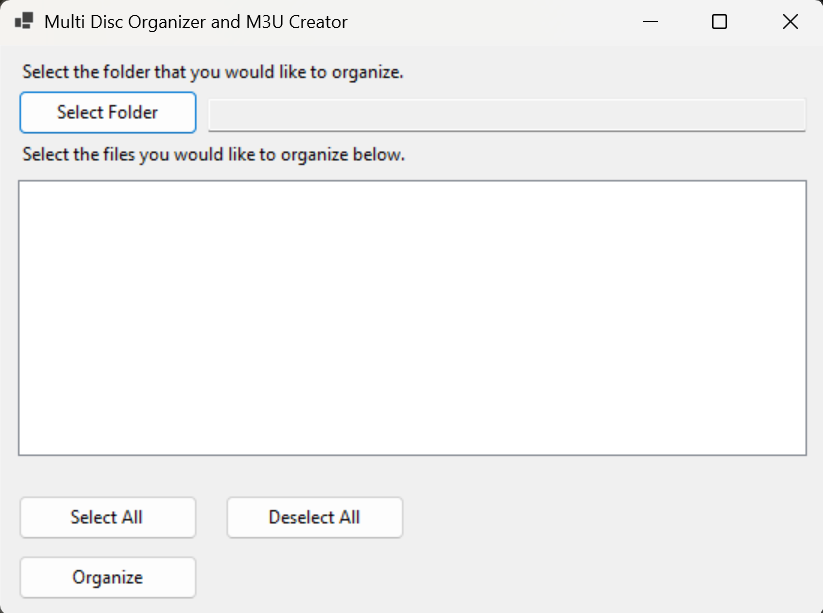
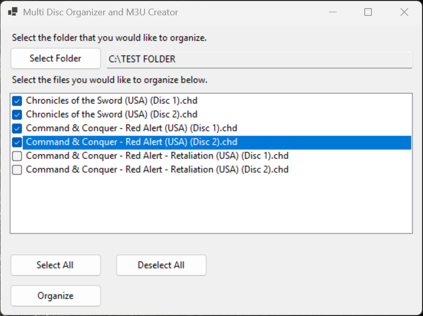
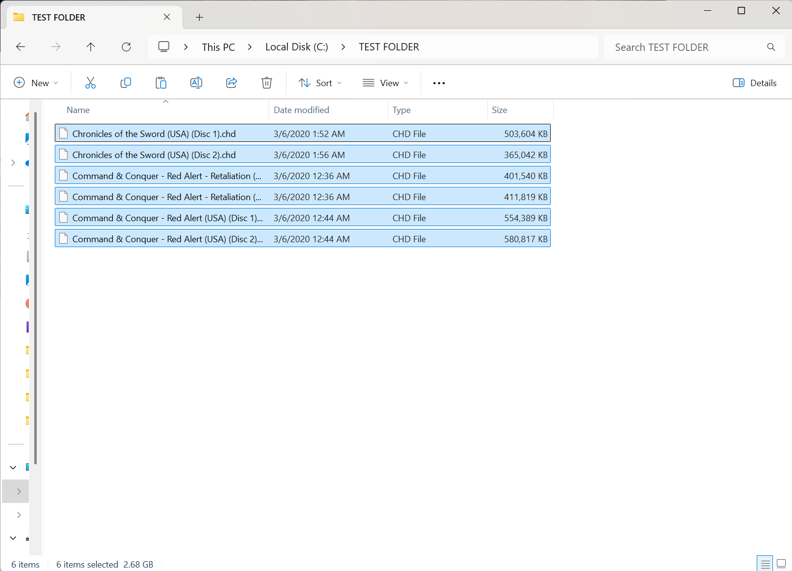
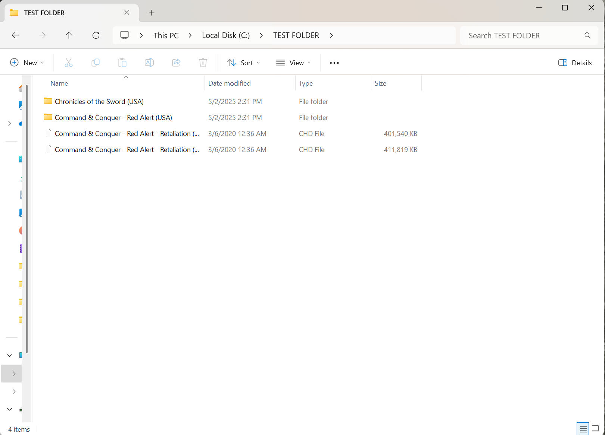
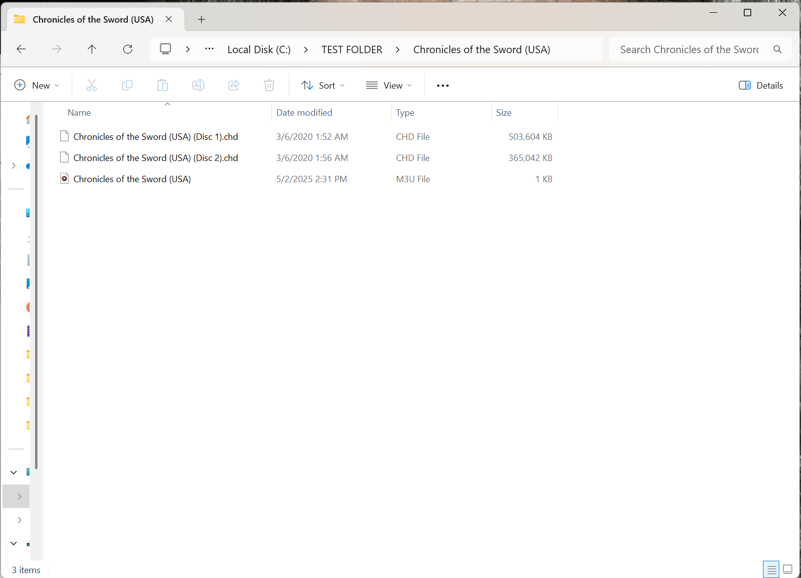
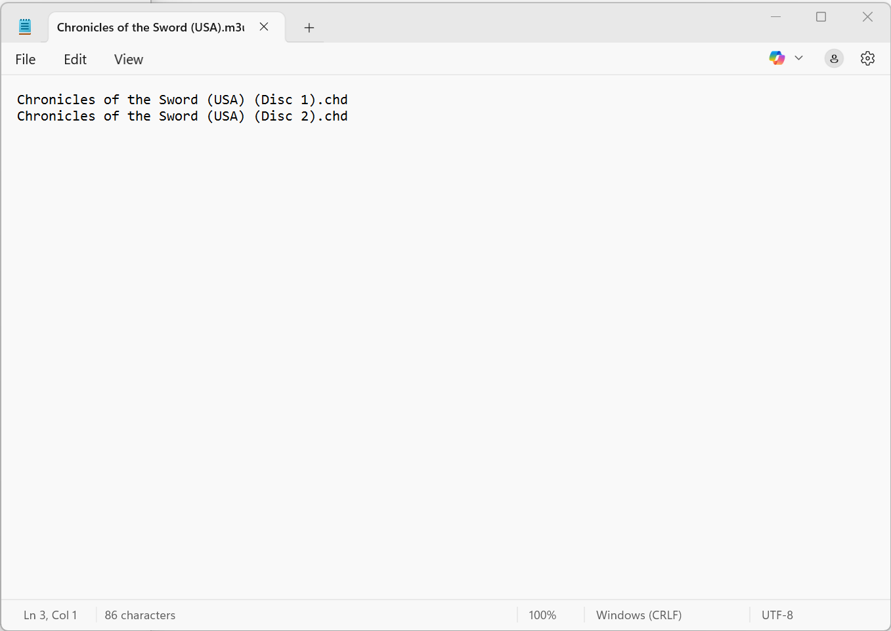
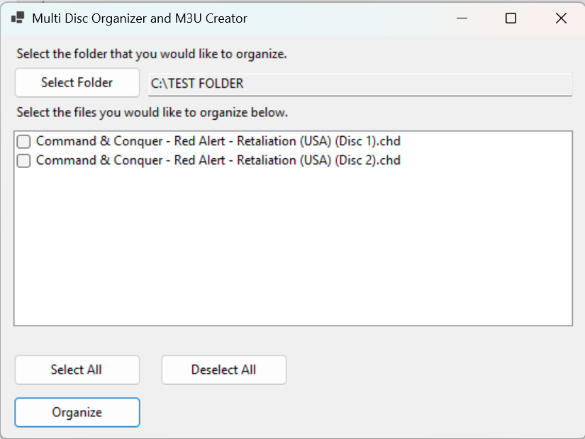

# Folder-M3U_Creator

## Overview
Folder-M3U_Creator is a C# application designed to organize multimedia files into directories based on their naming conventions and generate `.m3u` playlist files for batch processing. This tool is particularly useful for managing multi-disc or multi-disk collections and creating playlists for easy access to organized media. (for example. Rom files for emulation)

## Features
- Organizes files into directories based on naming patterns (e.g., `(disc X)`, `(disk X)`).
- Batch creation of `.m3u` playlist files for each organized directory.
- User-friendly interface for selecting folders and reviewing directory structures before execution.
- Supports Windows platforms with .NET 9.0 runtime.

## Provided Files in Repository

- net9.0-windows. This folder containes just the application. you will need to install windows net9.0 to run

- Win-x64 Folder. This is the complete selfcontained program that allows you to run the program without installing .NET SDK. click on the FolderM3uCreator.exe to run the program. 

- batchM3u_Creator_win-x64.zip. (zip of the folder above).

- FolderM3uCreatorInstaller.exe. is the installer if you would like to install the program and have a desktop icon.

## Usage
- Upon execution, the application will prompt you to select a folder.

- It will display a list of directories that can be created based on the files in the selected folder.

- You can deselect any files that you do not want to organize.

- Once confirmed, the application will organize the files and generate `.m3u` playlists.

- It will display an updated list of file that can be organized in the selected folder.

## License
This project is licensed under the MIT License. See the `LICENSE` file for more details.

____________________________________
© 2025 Pink727. All Rights Reserved.